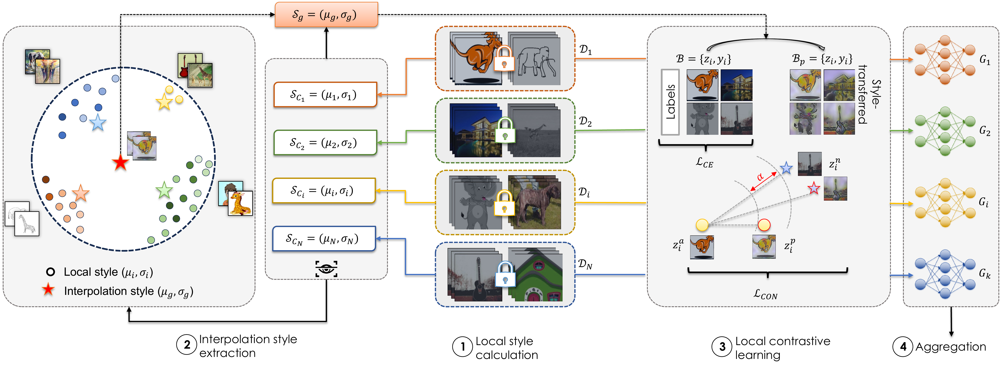

## PARDON: Privacy-Aware and Robust Federated Domain Generalization

This is the offical implementation for __PARDON__ paper, accepted at ICDCS 2025 | [arxiv](https://arxiv.org/abs/2410.22622)

*Authors*: Dung Thuy Nguyen, Taylor T. Johnson, Kevin Leach - Vanderbilt University

*Abstract*: Privacy and enabling collaborative learning, most current solutions concentrate on private data collected from a single domain. Yet, a substantial performance degradation on unseen domains arises when data among clients is drawn from diverse domains (i.e., domain shift). However, existing Federated Domain Generalization (FedDG) methods are typically designed under the assumption that each client has access to the complete dataset of a single domain. This assumption hinders their performance in real-world FL scenarios, which are characterized by domain-based heterogeneity—where data from a single domain is distributed heterogeneously across clients—and client sampling, where only a subset of clients participate in each training round. In addition, certain methods enable information sharing among clients, raising privacy concerns as this information could be used to reconstruct sensitive private data. 
To overcome this limitation, we present PARDON, a novel FedDG paradigm designed to robustly handle more complicated domain distributions between clients while ensuring security. PARDON facilitates client learning across domains by extracting an interpolative style from abstracted local styles obtained from each client and using contrastive learning. This approach provides each client with a multi-domain representation and an unbiased convergent target. Empirical results on multiple datasets, including PACS, Office-Home, and IWildCam, demonstrate PARDON’s superiority over state-of-the-art methods. Notably, our method outperforms SOTA techniques by a margin ranging from 3.64 to 57.22% in terms of accuracy on unseen domains.



### Available FedDG methods
* FedSR
* FedGMA
* FedDG-GA
* FPL
* CCST
* **PARDON**

### Environment preparation
```
conda create  --name <env> --file requirements.txt
```

### Prepare Datasets
All datasets derived from [Wilds](https://wilds.stanford.edu/) Datasets. We also implement [PACS](https://arxiv.org/abs/2007.01434) and [Office-Home](https://www.hemanthdv.org/officeHomeDataset.html) datasets.


### Downloads checkpoints
The checkpoints for pre-trained encoder and decoder for style transfer at [AdaIN-Style](https://github.com/xunhuang1995/AdaIN-style/blob/master/models/download_models.sh)

Then, put `decoder.pth` and `vgg_normalized.pth` under `src/models/`.

### Meta data (.csv) files are stored under each dataset folder
Example: ```./local/scratch/a/shared/datasets/pacs_v1.0/cs-a-p.csv```
Please download original metadata file from repo [Benchmarking Algorithms for Domain Generalization in Federated Learning](https://github.com/inouye-lab/FedDG_Benchmark), or contact dung.t.nguyen@vanderbilt.edu if you have any problem downloading and processing the data.

### Prepare WanDB.
First, please register an account on [WanDB](https://wandb.ai/). Then, in wandb_env.py, fill in the entity name and the project name (You could name another something else for your project).
The config can be modified using file ```wandb_env.py```

### Run Experiments
To run the experiments, simply prepare your config file $config_path, and run
```
python main.py --config_file $config_path
```
For example, to run *FISC* with PACS dataset:
```
python main.py --config_file config/FISC/PACS/scheme-01/fl_0.1_cs-a-p.json
```

### Methods
src/server.py and src/client.py contain the server-side and client-side methods, respectively. You could write your own server and client class as long as the interface with main.py is compatible. Or you can derive from our classes.


#### Server
All our methods on the server side are derived from the FedAvg class. This is a basic class that defines the behaviour of the client management, model communication and collection, data aggregation, client sampling, etc. Please derive from FedAvg and include your method. For instance, if your method has a different aggregation rule than FedAvg, just derive from FedAvg and reimplement the aggregation method.

#### Client
All our methods on the client side are derived from the ERM class. `fit` method defines the overall training between two communications. process_batch defines the pre-processing of one batch of data samples, and step defines one step of the objective updates. 

### Acknowledgement
[Benchmarking Algorithms for Domain Generalization in Federated Learning](https://github.com/inouye-lab/FedDG_Benchmark).

[First Integer Neighbor Clustering Hierarchy (FINCH) Algorithm](https://github.com/ssarfraz/FINCH-Clustering)

[Rethinking Federated Learning with Domain Shift: A Prototype View](https://github.com/WenkeHuang/RethinkFL)

[Federated Domain Generalization for Image Recognition via Cross-Client Style Transfer](https://github.com/JeremyCJM/CCST)

### Citation
- TBU
